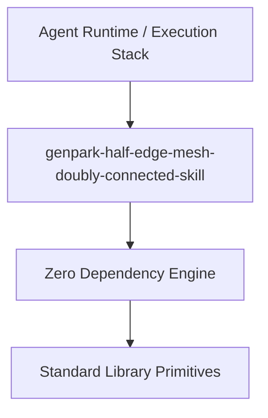

# genpark-half-edge-mesh-doubly-connected-skill

[](https://github.com/alphaparkinc/genpark-half-edge-mesh-doubly-connected-skill)
[](https://github.com/alphaparkinc/genpark-half-edge-mesh-doubly-connected-skill)
[](https://www.python.org/)

Doubly-Connected Edge List (DCEL) / Half-Edge polygon mesh structure supporting topological face circulation and Euler characteristic auditing.



## Features
- **Strict 0 Pip Dependencies**: Built completely using the Python Standard Library.
- **Fast Execution & Verification**: Includes client wrapper, MCP server, and verified test suites.
- **Agentic AI Ready**: Exposes standard MCP tools for continuous LLM integration.

## Installation & Quickstart
```bash
git clone https://github.com/alphaparkinc/genpark-half-edge-mesh-doubly-connected-skill.git
cd genpark-half-edge-mesh-doubly-connected-skill
python example_usage.py
```
